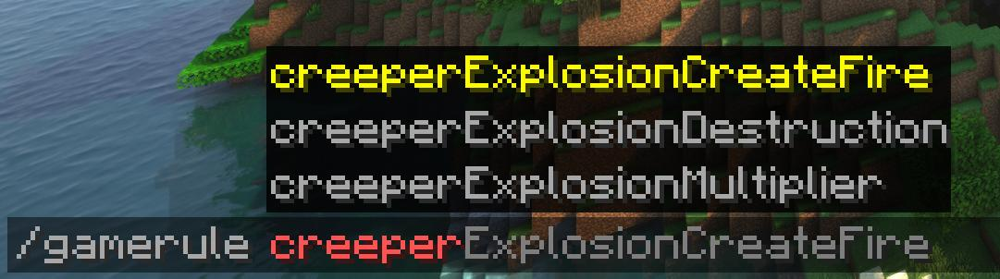
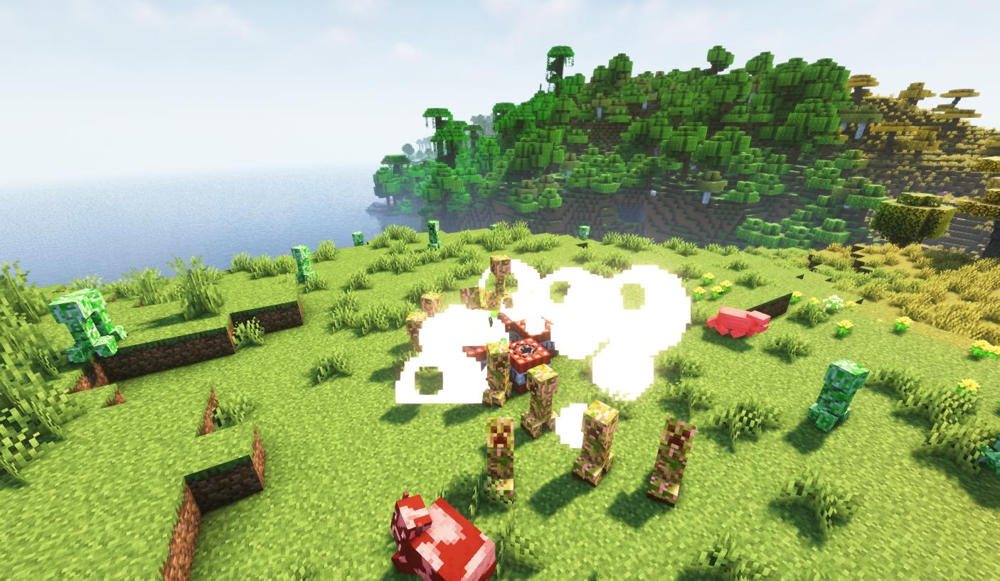
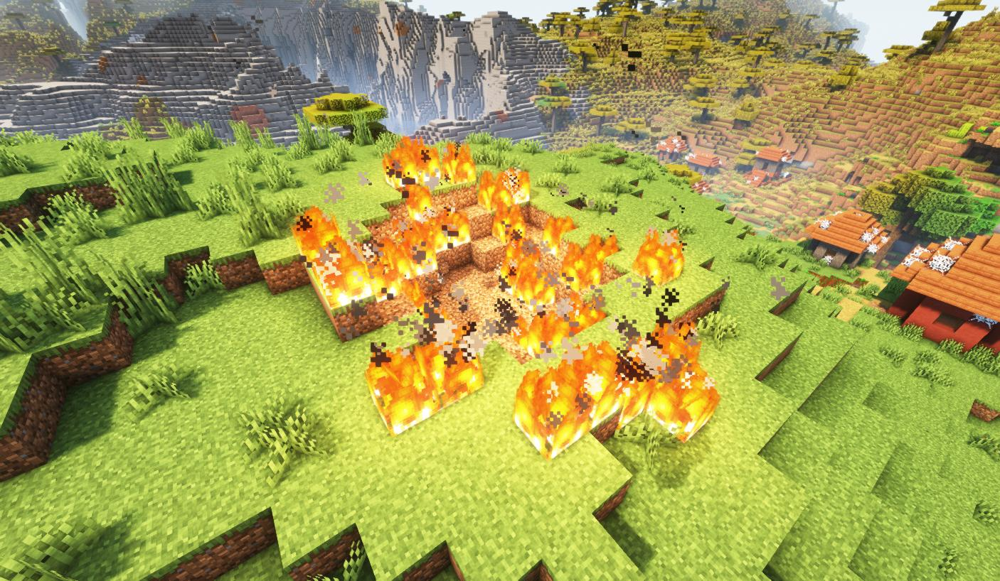
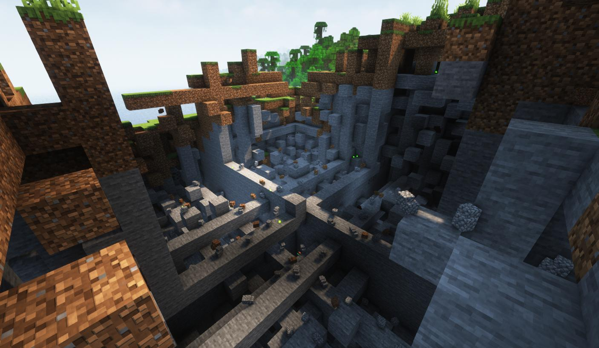

# Custom Explosions

[](https://fabricmc.net/)[](https://fabricmc.net/)

This is a mod allows you to modify explosion behaviours by gamerules. 



## GameRules

| GameRule                            | Value Type | Target(s)            |
| ----------------------------------- | ---------- | -------------------- |
| `creeperExplosionDestruction`       | Boolean    | Creeper              |
| `ghastFireBallExplosionDestruction` | Boolean    | Ghast FireBall       |
| `witherExplosionDestruction`        | Boolean    | Wither, Wither Skull |
| `tntExplosionDestruction`           | Boolean    | TNT, TNT Minecart    |
| `blockExplosionDestruction`         | Boolean    | Bed, Respawn Ancher  |
| `creeperExplosionCreateFire`        | Boolean    | Creeper              |
| `ghastFireBallExplosionCreateFire`  | Boolean    | Ghast FireBall       |
| `witherExplosionCreateFire`         | Boolean    | Wither, Wither Skull |
| `tntExplosionCreateFire`            | Boolean    | TNT, TNT Minecart    |
| `blockExplosionCreateFire`          | Boolean    | Bed, Respawn Ancher  |
| `creeperExplosionMultiplier`        | Double     | Creeper              |
| `ghastFireBallExplosionMultiplier`  | Double     | Ghast FireBall       |
| `witherExplosionMultiplier`         | Double     | Wither, Wither Skull |
| `tntExplosionMultiplier`            | Double     | TNT, TNT Minecart    |
| `blockExplosionMultiplier`          | Double     | Bed, Respawn Ancher  |

### Block Destruction

```mclang
/gamerule xxxExplosionDestruction [true | false]
```

If the block destruction is turned off, no block will be affect by the explosion, which means TNTs will not be ignited by the explosion as well. But the explosion can still damage entities.



### Create Fire

```mclang
/gamerule xxxExplosionCreateFire [true | false]
```



### Power Multiplier

```mclang
/gamerule xxxExplosionMultiplier <value>
```
Multiply the original explosion energy by the corresponding multiplier



## Installation

1. Install [Fabric ModLoader](https://fabricmc.net)
2. Download the `.jar` file
3. Put the `.jar` file into the `mods` folder under `.minecraft`
